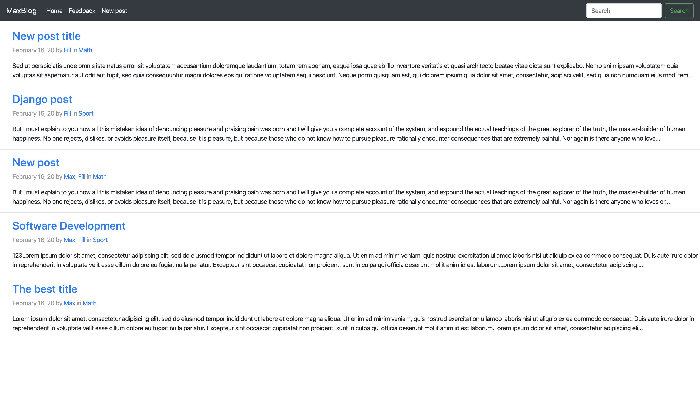
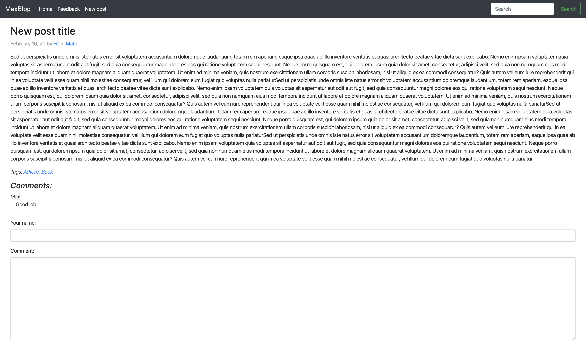
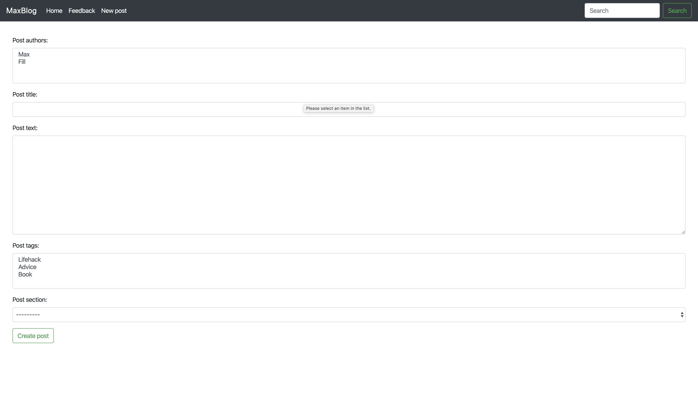
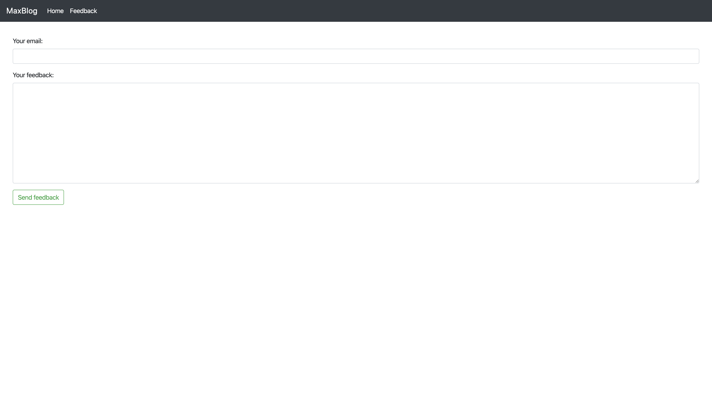
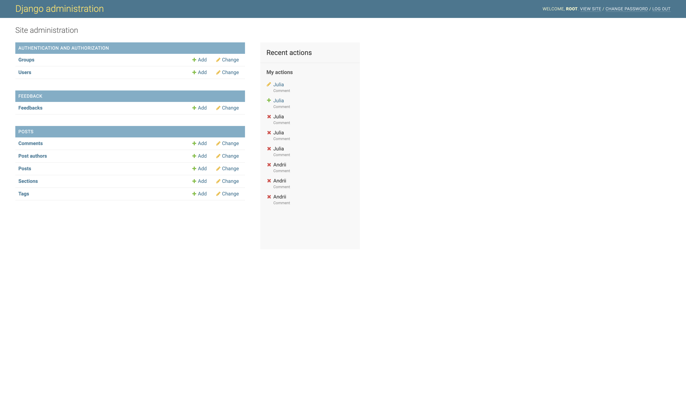

# MaxBlog

Blog application built using Python, Docker, HTML, and Django framework.
The Postgres database and Django application are placed in separate Docker containers and connected using ```docker-compose```.

## Description
1. The application has four web pages: the main webpage containing all of the created posts, the page with a detailed post view, the page to create new posts, and the feedback page. 
2. All webpages, except the feedback one, have a search box to search for posts by title or authors.
3. Each post has one or more authors, comments, text, creation time, section it relates to, title, and tags.
4. It is possible to search for posts related to a specific author/tag/section just by clicking on the author/tag/section hyperlink in the post info.
5. The feedback page has a form that contains a sender email field and a feedback text.
6. Admin panel can delete, edit and create posts, authors' comments, feedback, tags, and sections.

### Main page


### Post details page


### Create a post page


### Feedback page


### Admin panel

